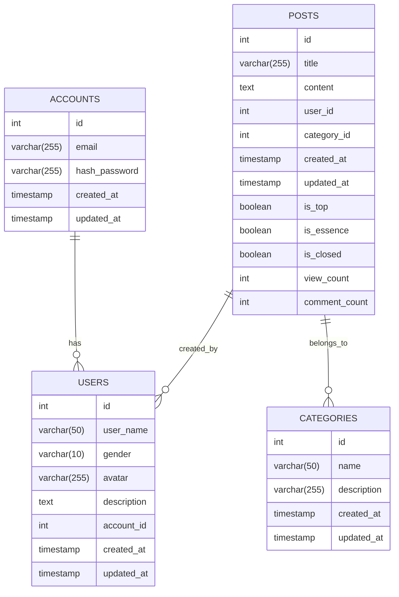

**账户表（Accounts）**

| 字段名 | 数据类型 | 主键/外键 | 可否为空 | 描述 |
| --- | --- | --- | --- | --- |
| id | int | 主键 | 否 | 自增id |
| email | varchar(255) |  | 否 | 邮箱地址 |
| hash_password | varchar(255) |  | 否 | 经过哈希加密的密码 |
| created_at | timestamp |  | 否 | 创建时间 |
| updated_at | timestamp |  | 否 | 最后更新时间 |

**用户表（Users）**

| 字段名 | 数据类型 | 主键/外键 | 可否为空 | 描述 |
| --- | --- | --- | --- | --- |
| id | int | 主键 | 否 | 自增id |
| user_name | varchar(50) |  | 否 | 用户名 |
| gender | varchar(10) |  | 是 | 性别 |
| avatar | varchar(255) |  | 是 | 用户头像 |
| description | text |  | 是 | 用户描述 |
| account_id | int | 外键 | 否 | 关联账户表的id |
| created_at | timestamp |  | 否 | 创建时间 |
| updated_at | timestamp |  | 否 | 最后更新时间 |

| 字段名 | 数据类型 | 主键/外键 | 可空 | 默认值 | 说明 |
| --- | --- | --- | --- | --- | --- |
| id | int | 主键 | 否 |  | 自增id |
| name | varchar(50) |  | 否 |  | 分类名称 |
| created_at | datetime |  | 否 |  | 创建时间 |
| updated_at | datetime |  | 否 |  | 最后更新时间 |

标签表（Tags）

| 字段名 | 数据类型 | 主键/外键 | 可空 | 默认值 | 说明 |
| --- | --- | --- | --- | --- | --- |
| id | int | 主键 | 否 |  | 自增id |
| name | varchar(50) |  | 否 |  | 标签名称 |
| created_at | datetime |  | 否 |  | 创建时间 |
| updated_at | datetime |  | 否 |  | 最后更新时间 |

帖子标签关联表（post_tag）

| 字段名 | 数据类型 | 主键/外键 | 可空 | 默认值 | 说明 |
| --- | --- | --- | --- | --- | --- |
| id | int | 主键 | 否 |  | 自增id |
| post_id | int | 外键 | 否 |  | 关联帖子表的id |
| tag_id | int | 外键 | 否 |  | 关联标签表的id |
| created_at | datetime |  | 否 |  | 创建时间 |
| updated_at | datetime |  | 否 |  | 最后更新时间 |

**收藏表(Collection)**

| 字段名 | 数据类型 | 主键/外键 | 可否为空 | 描述 |
| --- | --- | --- | --- | --- |
| id | int | 主键 | 否 | 自增id |
| user_id | int | 外键 | 否 | 用户id |
| post_id | int | 外键 | 否 | 帖子id |
| created_at | timestamp |  | 否 | 创建时间 |
| updated_at | timestamp |  | 否 | 最后更新时间 |

**评论表（Comments）**

| 字段名 | 数据类型 | 主键/外键 | 可否为空 | 描述 |
| --- | --- | --- | --- | --- |
| id | 整数 | 主键 | 否 | 自增id |
| content | 字符串 |  | 否 | 评论内容 |
| user_id | 整数 | 外键 | 否 | 评论用户id，关联用户表中的id |
| post_id | 整数 | 外键 | 否 | 评论文章id，关联帖子表中的id |
| parent_comment_id | 整数 | 外键 | 是 | 回复评论的id，关联评论表中的id |
| created_at | 时间戳 |  | 否 | 评论创建时间 |
| updated_at | 时间戳 |  | 否 | 最后更新时间 |

**点赞表（Likes）**

| 字段名 | 数据类型 | 主键/外键 | 可空 | 默认值 | 说明 |
| --- | --- | --- | --- | --- | --- |
| id | int | 主键 | 否 |  | 自增长id |
| user_id | int | 外键 | 否 |  | 点赞的用户id |
| post_id | int | 外键 | 否 |  | 点赞的文章id |
| created_at | datetime |  | 否 |  | 点赞时间 |

**举报表（Reports）**

| 字段名 | 数据类型 | 主键/外键 | 可空 | 默认值 | 说明 |
| --- | --- | --- | --- | --- | --- |
| id | int | 主键 | 否 |  | 自增长id |
| reporter_id | int |  | 否 |  | 举报者用户ID |
| report_type | int |  | 否 |  | 举报类型，1表示帖子，2表示评论 |
| report_id | int |  | 否 |  | 被举报帖子或评论的ID |
| reason | varchar(50) |  | 否 |  | 举报理由 |
| status | int |  | 否 | 0 | 处理状态，0表示未处理，1表示已处理 |
| created_at | datetime |  | 否 |  | 创建时间 |
| updated_at | datetime |  | 否 |  | 更新时间 |

**消息通知表（Notifications）**

| 字段名 | 数据类型 | 主键/外键 | 可空 | 默认值 | 说明 |
| --- | --- | --- | --- | --- | --- |
| id | int | 主键 | 否 |  | 消息通知的唯一标识 |
| user_id | int | 外键 | 否 |  | 接收消息通知的用户的唯一标识 |
| type | varchar(50) |  | 否 |  | 消息通知的类型，如“新评论”、“新回复”等 |
| content | text |  | 否 |  | 消息通知的具体内容 |
| read | boolean |  | 否 | false | 标记该消息通知是否已读 |
| created_at | datetime |  | 否 |  | 消息通知创建时间 |
| updated_at | datetime |  | 否 |  | 更新时间 |
